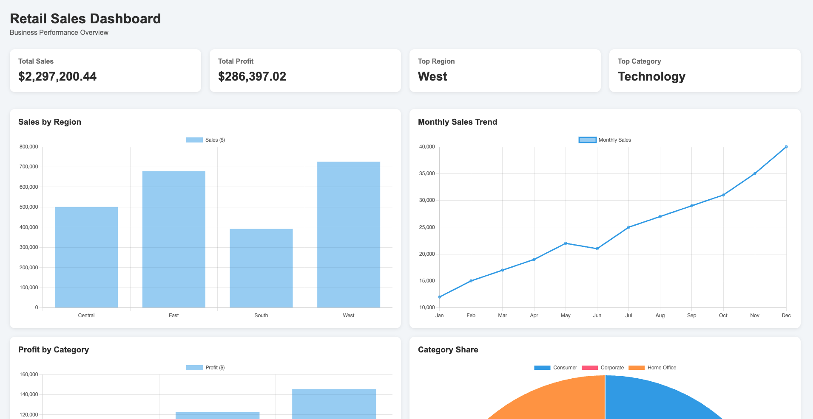

# Retail Sales Dashboard

## Overview

Interactive dashboard analyzing retail sales performance using the Superstore dataset.

## KPIs

- Total Sales: $2.3M
- Total Profit: $286K
- Top Region: West
- Top Category: Technology

## Key Findings

- West region generated the highest sales.
- Technology was the most profitable category.
- Consumer customers accounted for the largest share of revenue.
- Furniture produced significantly lower profit than other categories.

## Tools Used

- HTML
- CSS
- JavaScript
- Chart.js
- Git
- GitHub

